# Progettazione e Sviluppo di una Piattaforma Full-Stack per la Gestione di Biglietti per Eventi

## Sommario

Il presente elaborato descrive il percorso progettuale e realizzativo di TicketApp, una applicazione web single-page finalizzata alla gestione completa del ciclo di vita della vendita di biglietti per eventi. Il lavoro rappresenta la sintesi di un tirocinio formativo focalizzato sul rafforzamento delle competenze su backend e front-end, incorniciato da un solido approfondimento teorico sulle metodologie di sviluppo software, sulle
architetture applicative e sui protocolli di comunicazione.
L'attività ha previsto lo studio e l'applicazione dei principi AGILE e SCRUM, l'analisi comparata di architetture monolitiche e a microservizi, lo studio dei protocolli di rete e delle REST API, nonché l'impiego dei framework Spring e Angular 20 per la realizzazione delle componenti back-end e front-end.
Strumenti quali Figma, Insomnia, GitHub e GitHub Actions hanno supportato rispettivamente la progettazione visuale, la simulazione degli endpoint, il versionamento del codice e l'automazione dei processi CI/CD.
Il documento è articolato in otto capitoli che affrontano l'inquadramento teorico, la raccolta requisiti, la progettazione e la implementazione dell'applicazione, con
particolare attenzione ai processi di validazione dei biglietti da parte dello staff e alla gestione sicura delle interazioni client-server. La tesi si conclude con una valutazione critica dei risultati ottenuti e con la proposta di possibili sviluppi futuri per estendere l'impatto della piattaforma.

## Indice

- [1.0 Introduzione](#10-introduzione)
  - [1.1 Contesto dello stage](#11-contesto-dello-stage)
  - [1.2 Obiettivi formativi e professionali](#12-obiettivi-formativi-e-professionali)
  - [1.3 Descrizione generale del progetto](#13-descrizione-generale-del-progetto)
  - [1.4 Struttura della tesi](#14-struttura-della-tesi)
- [2.0 L’Azienda SyncLab s.r.l](#20-lazienda-synclab-srl)
  - [2.1 Storia e mission aziendale](#21-storia-e-mission-aziendale)
  - [2.2 Aree di competenza e principali settori di consulenza](#22-aree-di-competenza-e-principali-settori-di-consulenza)
  - [2.3 Struttura organizzativa](#23-struttura-organizzativa)
  - [2.4 Tecnologie e metodologie adottate in azienda](#24-tecnologie-e-metodologie-adottate-in-azienda)
- [3.0 Obiettivi e pianificazione dello stage](#30-obiettivi-e-pianificazione-dello-stage)
  - [3.1 Descrizione del percorso formativo](#31-descrizione-del-percorso-formativo)
  - [3.2 Obiettivi a breve e lungo termine](#32-obiettivi-a-breve-e-lungo-termine)
  - [3.3 Pianificazione delle attività tramite Trello](#33-pianificazione-delle-attivita-tramite-trello)
  - [3.4 Gestione delle card e dei task](#34-gestione-delle-card-e-dei-task)
  - [3.5 Monitoraggio dell’avanzamento](#35-monitoraggio-dellavanzamento)
  - [3.6 Metodologia di lavoro adottata](#36-metodologia-di-lavoro-adottata)
- [4.0 Fondamenti teorici e tecnologici](#40-fondamenti-teorici-e-tecnologici)
  - [4.1 Principi di buona programmazione](#41-principi-di-buona-programmazione)
  - [4.2 Principi SOLID](#42-principi-solid)
  - [4.3 Clean Code e best practice](#43-clean-code-e-best-practice)
  - [4.4 Architetture software](#44-architetture-software)
    - [4.4.1 Dal monolite ai microservizi](#441-dal-monolite-ai-microservizi)
    - [4.4.2 Vantaggi e svantaggi](#442-vantaggi-e-svantaggi)
    - [4.4.3 Componenti principali](#443-componenti-principali)
  - [4.5 Ripasso e strumenti di base](#45-ripasso-e-strumenti-di-base)
    - [4.5.1 Java SE e ambiente di sviluppo](#451-java-se-e-ambiente-di-sviluppo)
    - [4.5.2 Strumenti di supporto](#452-strumenti-di-supporto)
    - [4.5.3 Ciclo DevOps e GitHub Actions](#453-ciclo-devops-e-github-actions)
- [5.0 Tecnologie e framework utilizzati](#50-tecnologie-e-framework-utilizzati)
  - [5.1 Stack tecnologico del progetto](#51-stack-tecnologico-del-progetto)
    - [5.1.1 Panoramica generale](#511-panoramica-generale)
  - [5.2 Back-end](#52-back-end)
    - [5.2.1 Architettura a strati con Spring Boot](#521-architettura-a-strati-con-spring-boot)
    - [5.2.2 Modello di dominio e persistenza](#522-modello-di-dominio-e-persistenza)
    - [5.2.3 Gestione del ciclo di vita degli eventi](#523-gestione-del-ciclo-di-vita-degli-eventi)
    - [5.2.4 Vendita, fruizione e validazione dei biglietti](#524-vendita-fruizione-e-validazione-dei-biglietti)
    - [5.2.5 Sicurezza e provisioning degli utenti](#525-sicurezza-e-provisioning-degli-utenti)
    - [5.2.6 Osservabilità e documentazione delle API](#526-osservabilita-e-documentazione-delle-api)
  - [5.3 Front-end](#53-front-end)
    - [5.3.1 Architettura standalone e routing per ruoli](#531-architettura-standalone-e-routing-per-ruoli)
    - [5.3.2 Servizi HTTP tipizzati e gestione dello stato locale](#532-servizi-http-tipizzati-e-gestione-dello-stato-locale)
    - [5.3.3 Esperienza d’uso per i partecipanti](#533-esperienza-duso-per-i-partecipanti)
    - [5.3.4 Strumenti per organizzatori e staff](#534-strumenti-per-organizzatori-e-staff)
    - [5.3.5 Integrazione con Keycloak e distribuzione](#535-integrazione-con-keycloak-e-distribuzione)
  - [5.4 DevOps e containerizzazione](#54-devops-e-containerizzazione)
    - [5.4.1 Git e GitHub](#541-git-e-github)
    - [5.4.2 GitHub Actions](#542-github-actions)
    - [5.4.3 Docker](#543-docker)
- [6.0 Progettazione della piattaforma “Gestione Biglietti Eventi”](#60-progettazione-della-piattaforma-gestione-biglietti-eventi)
  - [6.1 Analisi dei requisiti funzionali e non funzionali](#61-analisi-dei-requisiti-funzionali-e-non-funzionali)
  - [6.2 Modellazione concettuale e logica](#62-modellazione-concettuale-e-logica)
    - [6.2.1 Diagrammi UML e casi d’uso](#621-diagrammi-uml-e-casi-duso)
    - [6.2.2 Definizione delle entità principali](#622-definizione-delle-entita-principali)
  - [6.3 Architettura del sistema](#63-architettura-del-sistema)
    - [6.3.1 Visione d’insieme](#631-visione-dinsieme)
    - [6.3.2 Comunicazione tra i moduli](#632-comunicazione-tra-i-moduli)
  - [6.4 Progettazione dell’interfaccia utente](#64-progettazione-dellinterfaccia-utente)
    - [6.4.1 Wireframe e mockup con Figma](#641-wireframe-e-mockup-con-figma)
    - [6.4.2 Scelte di design e UX](#642-scelte-di-design-e-ux)
  - [6.5 Flussi applicativi e ruoli utente](#65-flussi-applicativi-e-ruoli-utente)
- [7.0 Implementazione](#70-implementazione)
  - [7.1 Sviluppo del back-end](#71-sviluppo-del-back-end)
    - [7.1.1 Struttura del progetto Spring Boot](#711-struttura-del-progetto-spring-boot)
    - [7.1.2 CRUD per eventi e biglietti](#712-crud-per-eventi-e-biglietti)
    - [7.1.3 Testing delle API con Insomnia](#713-testing-delle-api-con-insomnia)
    - [7.1.4 Endpoints e logiche applicative](#714-endpoints-e-logiche-applicative)
    - [7.1.5 Integrazione con Keycloak e policy di accesso](#715-integrazione-con-keycloak-e-policy-di-accesso)
    - [7.1.6 Gestione concorrente dell’acquisto dei biglietti](#716-gestione-concorrente-dellacquisto-dei-biglietti)
    - [7.1.7 Generazione e caching dei QR code](#717-generazione-e-caching-dei-qr-code)
  - [7.2 Sviluppo del front-end](#72-sviluppo-del-front-end)
    - [7.2.1 Struttura delle cartelle Angular](#721-struttura-delle-cartelle-angular)
    - [7.2.2 Comunicazione con il back-end](#722-comunicazione-con-il-back-end)
    - [7.2.3 Validazione dei form e gestione stati](#723-validazione-dei-form-e-gestione-stati)
    - [7.2.4 Route guard per la gestione dei ruoli](#724-route-guard-per-la-gestione-dei-ruoli)
    - [7.2.5 Ricerca eventi con form reattive e debounce](#725-ricerca-eventi-con-form-reattive-e-debounce)
    - [7.2.6 Validazione dei ticket con QR scanner e fallback manuale](#726-validazione-dei-ticket-con-qr-scanner-e-fallback-manuale)
    - [7.2.7 Esperienza utente per i diversi ruoli](#727-esperienza-utente-per-i-diversi-ruoli)
    - [7.2.8 Componenti riutilizzabili e Quick Guide](#728-componenti-riutilizzabili-e-quick-guide)
    - [7.2.9 Schermate principali dell’interfaccia](#729-schermate-principali-dellinterfaccia)
  - [7.3 Integrazione e versionamento](#73-integrazione-e-versionamento)
    - [7.3.1 Utilizzo di Git e GitHub](#731-utilizzo-di-git-e-github)
    - [7.3.2 Workflow di sviluppo collaborativo](#732-workflow-di-sviluppo-collaborativo)
  - [7.4 Containerizzazione e deploy](#74-containerizzazione-e-deploy)
    - [7.4.1 Configurazione di Docker](#741-configurazione-di-docker)
    - [7.4.2 Automazione tramite GitHub Actions](#742-automazione-tramite-github-actions)
- [8.0 Risultati e test](#80-risultati-e-test)
  - [8.1 Verifica funzionale](#81-verifica-funzionale)
  - [8.2 Test di integrazione e validazione](#82-test-di-integrazione-e-validazione)
  - [8.3 Performance e stabilità](#83-performance-e-stabilita)
  - [8.4 Problemi riscontrati e soluzioni adottate](#84-problemi-riscontrati-e-soluzioni-adottate)
- [9.0 Considerazioni finali](#90-considerazioni-finali)
  - [9.1 Risultati raggiunti](#91-risultati-raggiunti)
  - [9.2 Competenze acquisite](#92-competenze-acquisite)
  - [9.3 Possibili sviluppi futuri](#93-possibili-sviluppi-futuri)
  - [9.4 Conclusioni personali](#94-conclusioni-personali)

## 1.0 Introduzione

### 1.1 Contesto dello stage

Il presente elaborato descrive l’esperienza di stage curricolare svolta presso SyncLab s.r.l., società di consulenza tecnologica con sede principale a Napoli e sedi operative distribuite sul territorio nazionale. Il tirocinio, della durata di due mesi, ha coinvolto la divisione dedicata allo sviluppo di soluzioni software cloud-native e ha offerto l’opportunità di inserirmi in un contesto professionale strutturato, caratterizzato da processi agili, mentoring costante e forte orientamento alla qualità del codice.

### 1.2 Obiettivi formativi e professionali

Gli obiettivi concordati con il tutor aziendale e con il referente accademico avevano una duplice natura. Da un lato era prevista la revisione sistematica delle conoscenze teoriche acquisite nel percorso universitario (principi SOLID, Clean Code, programmazione in Java, sviluppo web). Dall’altro lato lo stage mirava a consolidare competenze professionali trasversali, come la capacità di pianificare il lavoro, collaborare in team distribuiti e utilizzare strumenti di produttività e versionamento in scenari reali.

Gli obiettivi formativi principali possono essere
sintetizzati come segue:

- consolidare l’utilizzo delle metodologie AGILE e SCRUM in un contesto reale,
con cicli iterativi di rilascio;
- approfondire la progettazione e l’implementazione di REST API sicure basate
su Spring Boot e Spring Data JPA;
- padroneggiare Angular 20 per la costruzione di interfacce reattive e modulabili;
- integrare strumenti di design (Figma), mock (Insomnia) e versionamento (Git/GitHub)
in un flusso end-to-end coerente;
- realizzare pipeline di integrazione e distribuzione continua con GitHub Actions.

### 1.3 Descrizione generale del progetto

Al termine del percorso formativo propedeutico era previsto lo sviluppo di una piattaforma Full-Stack per la gestione dei biglietti di eventi, composta da un back-end basato su microservizi Spring Boot e un front-end realizzato in Angular 20. Il progetto Eventi, pensato per coprire l’intero ciclo di vita di un ticket (creazione, modifica, assegnazione, validazione), ha rappresentato un banco di prova per applicare i concetti studiati e per lavorare in modo integrato su componenti di natura diversa.

### 1.4 Struttura della tesi

La tesi è organizzata in nove capitoli. Dopo l’introduzione, il secondo capitolo contestualizza SyncLab. Il terzo capitolo illustra obiettivi e pianificazione dello stage. Il quarto e il quinto capitolo approfondiscono i fondamenti teorici e le tecnologie adottate. I capitoli sesto e settimo descrivono rispettivamente la progettazione e l’implementazione della piattaforma. L’ottavo capitolo presenta i risultati e l’attività di test, mentre il nono offre le considerazioni finali.

## 2.0 L’Azienda SyncLab s.r.l

### 2.1 Storia e mission aziendale

Sync Lab nasce a Napoli nel 2002 come software house ed è rapidamente cresciuta nel mercato dell'Information and Comunications Tecnology (ICT)G . A seguito di una maturazione delle competenze tecnologiche, metodologiche ed applicative nel dominio del software, l'azienda è riuscita rapidamente a trasformarsi in System Integrator conquistando significative fette di mercato nei settori mobile, videosorveglianza e sicurezza delle infrastrutture informatiche aziendali. Attualmente, Sync Lab ha più di 150 clienti diretti e finali, con un organico aziendale di 200 dipendenti distribuiti tra le 5 sedi dislocate in tutta Italia.
Sync Lab si pone come obiettivo principale quello di supportare il cliente nella realizzazione, messa in opera e governance di soluzione IT, sia dal punto di vista tecnologico, sia nel governo del cambiamento organizzativo.


*Figura 2.1 – Logo istituzionale di SyncLab s.r.l.*

### 2.2 Aree di competenza e principali settori di consulenza

Le principali aree di consulenza includono lo sviluppo di applicazioni enterprise, la migrazione al cloud, la business intelligence e l’automazione dei processi. L’azienda opera in settori eterogenei: pubblica amministrazione, utilities, telecomunicazioni e industria manifatturiera. La capacità di combinare conoscenze tecnologiche con la comprensione del dominio applicativo consente a SyncLab di proporre soluzioni end-to-end, dall’analisi dei requisiti al rilascio in produzione.

### 2.3 Struttura organizzativa

SyncLab adotta una struttura organizzativa a matrice: da un lato esistono le business unit dedicate ai diversi settori di mercato, dall’altro sono presenti practice interne verticalizzate sulle competenze tecnologiche (Cloud, Data & Analytics, Software Engineering, DevOps). I team di progetto sono multidisciplinari e includono figure di analisi, sviluppo, quality assurance e project management. Durante lo stage sono stato inserito nella practice Software Engineering, lavorando a stretto contatto con sviluppatori senior e un mentor dedicato.

### 2.4 Tecnologie e metodologie adottate in azienda

L’azienda promuove un approccio DevOps e l’adozione di metodologie agili, selezionando Scrum o Kanban in base alle esigenze progettuali. I tool maggiormente utilizzati comprendono piattaforme di project management (Jira, Trello), servizi di version control (GitHub, GitLab), strumenti di modellazione (LucidChart), ambienti di sviluppo integrati (Visual Studio Code, IntelliJ IDEA) e soluzioni per l’automazione del ciclo di vita (GitHub Actions, Jenkins). Questa infrastruttura di strumenti è stata messa a disposizione anche durante lo stage, consentendo di sperimentare pratiche professionali consolidate.

## 3.0 Obiettivi e pianificazione dello stage

### 3.1 Descrizione del percorso formativo

Il percorso formativo è stato suddiviso in due macro fasi. La prima, della durata di quattro settimane, ha previsto attività di studio guidato e produzione di brevi esercitazioni. La seconda fase si è concentrata sulla progettazione e implementazione della piattaforma Eventi, con momenti alternati di analisi, sviluppo, test e retrospettiva. Ogni attività veniva pianificata in Trello e discussa durante incontri settimanali con il tutor.

### 3.2 Obiettivi a breve e lungo termine

Tra gli obiettivi a breve termine figuravano il ripasso dei principi di buona programmazione, la familiarizzazione con gli strumenti (IDE, Insomnia, Figma, Trello) e l’acquisizione delle basi di Spring Boot e Angular. Gli obiettivi a lungo termine riguardavano la padronanza dell’architettura a microservizi, la capacità di modellare un dominio applicativo complesso, la scrittura di API REST scalabili e la creazione di interfacce utente reattive. Il completamento della piattaforma e la preparazione di pipeline di integrazione continua costituivano gli output principali.

### 3.3 Pianificazione delle attività tramite Trello

Tutte le attività sono state mappate in Trello, organizzando le card in liste corrispondenti alle fasi del flusso di lavoro: Opzionali, Da Fare, In esecuzione, Verifica, Terminati. Ogni card riportava la descrizione dell’attività, la checklist delle sotto-attività, i riferimenti a risorse esterne e la stima in giorni. Questo approccio ha favorito la trasparenza sullo stato delle lavorazioni e ha permesso di tracciarne l’evoluzione quotidiana.

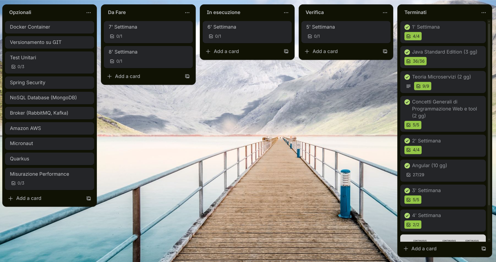

*Figura 3.1 – Board Trello utilizzata per la pianificazione dello stage.*

### 3.4 Gestione delle card e dei task

Le card venivano arricchite con commenti e allegati, in particolare schermate di Figma, diagrammi di LucidChart e query di test realizzate con Insomnia. Il mentor supervisionava le card critiche e proponeva eventuali refinements. La granularità dei task è stata calibrata per garantire un flusso continuo, evitando task troppo ampi che potessero rallentare il feedback.

### 3.5 Monitoraggio dell’avanzamento

Il monitoraggio del progresso avveniva con incontri giornalieri informali e un meeting settimanale di allineamento. Attraverso Trello era possibile visualizzare grafici di burn-down e tempi medi di completamento. A metà stage è stata effettuata una retrospettiva per analizzare ostacoli e definire azioni correttive: tra queste l’introduzione di checklist di validazione per le CRUD e la pianificazione anticipata delle attività di test.

### 3.6 Metodologia di lavoro adottata

Pur non adottando una implementazione completa di Scrum, il team ha seguito un approccio agile iterativo con time-boxing settimanale. Ogni ciclo prevedeva la selezione delle card prioritarie, lo sviluppo incrementale delle funzionalità e la verifica di qualità. L’adattabilità ai cambiamenti e la frequenza di feedback hanno garantito una rapida maturazione delle competenze e la consegna progressiva del software.

## 4.0 Fondamenti teorici e tecnologici

### 4.1 Principi di buona programmazione

La revisione dei fondamenti ha riguardato gli aspetti chiave della progettazione software: modularità, incapsulamento, coesione e disaccoppiamento. Particolare attenzione è stata dedicata alla scrittura di codice manutenibile e leggibile, alla gestione delle dipendenze e all’automazione dei test unitari per prevenire regressioni.

### 4.2 Principi SOLID

I principi SOLID (Single Responsibility, Open/Closed, Liskov Substitution, Interface Segregation, Dependency Inversion) sono stati approfonditi attraverso esempi pratici in Java. Durante la realizzazione dei servizi di dominio, ad esempio, il principio di singola responsabilità ha guidato la suddivisione delle classi, mentre l’inversione delle dipendenze ha portato all’uso di interfacce e injection framework offerti da Spring.

### 4.3 Clean Code e best practice

L’approccio Clean Code ha indirizzato le scelte di naming, la struttura dei metodi e l’organizzazione dei package. È stato adottato un ciclo di refactoring continuo per eliminare duplicazioni, semplificare le condizioni e introdurre test automatici. Gli strumenti di statica analysis integrati nell’IDE hanno supportato l’individuazione precoce di code smell.

### 4.4 Architetture software

#### 4.4.1 Dal monolite ai microservizi

Lo studio dell’evoluzione architetturale ha evidenziato le differenze tra applicazioni monolitiche e sistemi a microservizi. Partendo da un contesto monolitico tipico delle applicazioni legacy, è stato analizzato il percorso di decomposizione in servizi autonomi, focalizzandosi sulla definizione dei boundary di dominio e sulla comunicazione tramite API.

#### 4.4.2 Vantaggi e svantaggi

L’adozione dei microservizi porta vantaggi in termini di scalabilità indipendente, deploy autonomi e resilienza. Tuttavia introduce complessità legate al coordinamento, alla latenza e al monitoraggio distribuito. Durante lo stage si è discusso di strategie per mitigare tali criticità (logging centralizzato, metriche, API versioning).

#### 4.4.3 Componenti principali

Sono stati analizzati gli elementi cardine di un ecosistema a microservizi: API Gateway per unificare l’accesso e applicare politiche di sicurezza, Service Discovery e Service Registry per orchestrare i servizi in ambiente dinamico, pattern di resilienza come Circuit Breaker per prevenire fault cascata e Saga per gestire transazioni distribuite mantenendo la consistenza eventuale.

### 4.5 Ripasso e strumenti di base

#### 4.5.1 Java SE e ambiente di sviluppo

Il ripasso di Java Standard Edition si è focalizzato su collezioni, stream API, gestione delle eccezioni e programmazione concorrente. Visual Studio Code, configurato con estensioni dedicate, è stato l’IDE principale; sono state esplorate funzionalità di debugging, profiling leggero e integrazione con il terminale.

#### 4.5.2 Strumenti di supporto

Insomnia è stato utilizzato per disegnare e testare richieste HTTP; Figma per produrre wireframe e mockup dell’interfaccia; Trello e LucidChart hanno supportato rispettivamente la pianificazione e la modellazione. L’utilizzo combinato di tali strumenti ha permesso di mantenere allineata la documentazione con lo sviluppo effettivo.

#### 4.5.3 Ciclo DevOps e GitHub Actions

Sono stati introdotti i principi del ciclo DevOps: continuous integration, continuous delivery e feedback continuo. In particolare è stata configurata una pipeline GitHub Actions in grado di eseguire build, test e linting a ogni push, garantendo un controllo di qualità automatico e riducendo i tempi di revisione.

## 5.0 Tecnologie e framework utilizzati

### 5.1 Stack tecnologico del progetto

#### 5.1.1 Panoramica generale

La piattaforma Eventi è stata sviluppata con uno stack Full-Stack moderno: back-end in Java 17 con Spring Boot, database relazionale PostgreSQL, front-end in Angular 20 scritto in TypeScript, orchestrazione dei container con Docker e pipeline di integrazione su GitHub Actions. Il codice è stato versionato su GitHub e organizzato in un repository monorepo con directory separate per back-end e front-end.

### 5.2 Back-end

#### 5.2.1 Architettura a strati con Spring Boot

Il back-end è un servizio monolitico Spring Boot 3 che espone API REST stateless. L’applicazione è organizzata in tre strati principali: controller (`com.chicco.backend.controllers`) che espongono gli endpoint versionati sotto `/api/v1`, servizi (`com.chicco.backend.services`) che contengono la logica di business e repository Spring Data JPA per l’accesso al database PostgreSQL. MapStruct viene utilizzato per trasformare in modo tipizzato DTO di richiesta/risposta e oggetti di dominio, riducendo il codice di mapping manuale. Tutte le chiamate accedono al livello di servizio passando per DTO validati con `jakarta.validation`, garantendo la coerenza dei dati ricevuti dal front-end.

Il bootstrap dell’applicazione è gestito dalla classe `BackendApplication`, annotata con `@SpringBootApplication`: l’invocazione di `SpringApplication.run(...)` crea l’`ApplicationContext` e attiva l’autoconfigurazione offerta dagli starter (web, data-jpa, validation, security). Il container di inversione del controllo rileva automaticamente le classi marcate con `@RestController`, `@Service`, `@Repository` e `@Component`, istanziandole una sola volta (bean singleton) e iniettando le dipendenze richieste attraverso il costruttore. Questa dinamica permette ai controller di dipendere da interfacce (`EventService`, `TicketService`, ecc.) senza preoccuparsi della loro implementazione concreta, che viene risolta dal contesto al momento dell’avvio. Spring Data genera proxy runtime per i repository, intercettando le chiamate per costruire dinamicamente le query e coordinando l’entity manager.

Le operazioni critiche sono decorate con `@Transactional`, così che il `PlatformTransactionManager` gestisca automaticamente l’apertura e la chiusura delle transazioni sul persistence context di JPA. In caso di eccezione l’operazione viene annullata (`rollback`), garantendo consistenza tra le tabelle e prevenendo condizioni di race durante l’acquisto concorrente dei biglietti. Il motore di validazione Bean Validation, configurato tramite `LocalValidatorFactoryBean`, applica le regole annotate sui DTO prima di invocare la logica di business, mentre il binding delle proprietà esterne (`application.properties` e variabili d’ambiente) popola le configurazioni di sicurezza e di connessione al database. L’insieme di questi meccanismi riduce il codice boilerplate e consente di concentrarsi sui casi d’uso di dominio.

#### 5.2.2 Modello di dominio e persistenza

Il dominio ruota attorno alle entità `Event`, `TicketType`, `Ticket`, `TicketValidation` e `User`, tutte annotate con JPA e collegate da relazioni esplicite. Una classe astratta `Log` fornisce audit trail automatico (`createdAt`, `updatedAt`) grazie all’annotazione `@EnableJpaAuditing`. L’`EventRepository` espone query personalizzate per filtrare gli eventi pubblicati, mentre il `TicketTypeRepository` ricorre a un lock pessimistic write per evitare overselling durante l’acquisto concorrente. La configurazione prevede PostgreSQL come database di riferimento (via Docker Compose), con schema aggiornato automaticamente in ambiente di sviluppo (`spring.jpa.hibernate.ddl-auto=update`).

#### 5.2.3 Gestione del ciclo di vita degli eventi

`EventServiceImpl` governa la creazione, l’aggiornamento e l’eliminazione degli eventi legandoli all’organizzatore autenticato. Le operazioni di update gestiscono in modo differenziato creazione, modifica e rimozione dei ticket type associati, validando la coerenza degli identificativi e sollevando eccezioni dedicate in caso di violazioni. Gli eventi pubblicati sono resi disponibili anche a utenti non autenticati tramite il `PublishedEventController`, che offre ricerca full-text e filtraggio per tipologia con paginazione.

#### 5.2.4 Vendita, fruizione e validazione dei biglietti

La vendita dei biglietti è incapsulata in `TicketTypeServiceImpl`, che verifica la disponibilità residua calcolando i ticket già emessi e limita l’acquisto a un massimo di dieci unità per richiesta. `TicketServiceImpl` consente all’acquirente di consultare i propri ticket e di generare il QR code in formato PNG: la prima generazione salva la rappresentazione Base64 nel database per ridurre il carico computazionale delle richieste successive. Il processo di validazione sul campo è affidato a `TicketValidationServiceImpl`, che registra ogni controllo (manuale o tramite QR) e marca il ticket come invalido se già validato in precedenza, fornendo al personale di sala un feedback immediato.

#### 5.2.5 Sicurezza e provisioning degli utenti

La sicurezza è gestita in modalità resource server OAuth2 con JWT rilasciati da Keycloak. `SecurityConfig` definisce una `SecurityFilterChain` stateless con CORS configurabile e regole di autorizzazione granulari: gli endpoint eventi sono riservati al ruolo `ROLE_ORGANIZER`, la validazione biglietti al ruolo `ROLE_STAFF`, mentre la consultazione del catalogo pubblico è aperta. Il convertitore `JwtAuthenticationConverter` mappa i ruoli provenienti dal token, e il filtro custom `UserProvisioningFilter` sincronizza automaticamente nel database il profilo dell’utente autenticato (id Keycloak, username ed email) senza richiedere una fase di registrazione manuale. La configurazione dei JWT (issuer e JWKS) è sovrascrivibile via variabili d’ambiente, facilitando l’esecuzione in container.

#### 5.2.6 Osservabilità e documentazione delle API

Per l’allineamento tra team è stato introdotto SpringDoc OpenAPI: `OpenApiConfig` genera due gruppi di documentazione (pubblica e interna) e abilita la UI di Swagger raggiungibile da `/api/v1/docs/ui`. Gli errori applicativi sono intercettati da un `GlobalExceptionHandler` che centralizza la gestione delle eccezioni e produce risposte JSON uniformi (`ErrorDto`) con codici HTTP coerenti. La presenza di DTO specifici per ogni use case e di eccezioni semantiche (`TicketSoldOutException`, `EventUpdateException`, ecc.) facilita il tracciamento dei problemi e la manutenzione futura del servizio.

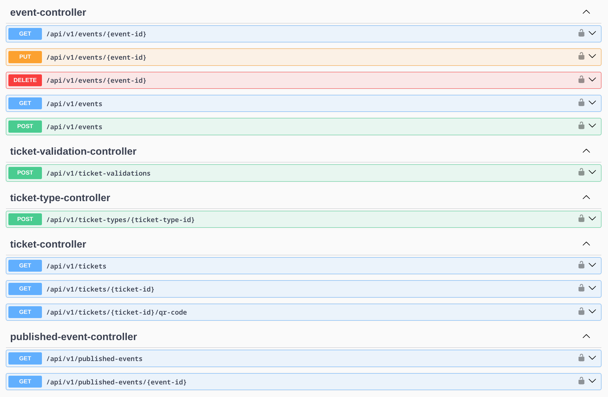

*Figura 5.1 – Documentazione interattiva generata con SpringDoc OpenAPI.*

### 5.3 Front-end

#### 5.3.1 Architettura standalone e routing per ruoli

L’interfaccia è sviluppata con Angular 20 in modalità standalone, eliminando i tradizionali NgModule e puntando su componenti auto-descriventi caricati in lazy loading. Il file `app.routes.ts` definisce un routing versionato che separa i percorsi per i tre ruoli gestiti dal back-end (`ROLE_ATTENDEE`, `ROLE_ORGANIZER`, `ROLE_STAFF`). Il guard `canActivateAuthRole` sfrutta `keycloak-angular` per verificare autenticazione e privilegi, aprendo un dialog di “forbidden” quando l’utente tenta di raggiungere una pagina senza diritti. In questo modo la navigazione riflette esattamente le policy applicate dalle API Spring Security.

Angular adotta un’architettura dichiarativa basata su componenti e template: ogni classe annotata con `@Component` dichiara il markup HTML, gli stili e le dipendenze necessarie, generando un albero di componenti che il framework mantiene sincronizzato tramite change detection. L’iniezione delle dipendenze è gestita dal proprio IoC container, che mette a disposizione i servizi a livello gerarchico (root, feature o component) e consente di condividere logica riutilizzabile come i servizi HTTP o gli helper di formattazione. I template sfruttano data binding unidirezionale (`{{ }}`) e bidirezionale (`[(ngModel)]`/`formControlName`), insieme a direttive strutturali (`*ngIf`, `*ngFor`) per modellare l’interfaccia in base allo stato. Lato runtime il motore Ivy compila i componenti in istruzioni JavaScript ottimizzate, mentre RxJS fornisce primitives asincrone (Observable, Subject) che alimentano la gestione reattiva degli eventi UI e delle chiamate HTTP.

#### 5.3.2 Servizi HTTP tipizzati e gestione dello stato locale

La comunicazione con il back-end avviene tramite servizi riutilizzabili (`EventsService`, `PublishedEventsService`, `TicketsService`, `TicketTypesService`, `TicketValidationService`) che incapsulano le chiamate agli endpoint `/api/v1/**`. Un helper `buildApiUrl` costruisce gli URI partendo dalle costanti usate anche nel back-end, mentre l’interceptor fornito da `keycloak-angular` allega automaticamente il bearer token per le richieste che corrispondono alla regex `/api/v1/`. L’ambiente di punta definisce `apiUrl: '/api/v1'`, consentendo di eseguire l’app dietro proxy o tramite il reverse proxy Nginx incluso in Docker Compose. Lo stato è mantenuto a livello di componente attraverso `signals`, reactive form e sottoscrizioni RxJS, evitando l’introduzione di uno store globale non necessario in questa fase.

#### 5.3.3 Esperienza d’uso per i partecipanti

Le pagine della sezione attendee (`published-events`, `published-event-details`, `purchase-ticket`, `tickets`, `ticket-details`, `ticket-qr-code`) forniscono un flusso completo dalla ricerca all’acquisto. La home consente di filtrare gli eventi pubblicati usando reactive forms con debounce e Angular Material (card, paginator, select), attingendo all’API di ricerca pubblica esposta dal `PublishedEventController`. Durante l’acquisto i form validano quantità e disponibilità coerentemente con le regole del servizio `TicketTypeServiceImpl`, mostrando errori restituiti dal back-end come il conflitto per sold-out. Per le ricevute viene utilizzata una `MoneyPipe` custom che formatta importi e totale in modo consistente.

#### 5.3.4 Strumenti per organizzatori e staff

Gli organizzatori accedono a viste dedicate (`organizer/events`, `create-event`, `update-event`, `guide`) dove possono orchestrare il lifecycle degli eventi con form dinamici che gestiscono ticket type multipli e si sincronizzano con le API CRUD di `EventController`. I feedback di successo vengono memorizzati in un buffer temporaneo (`setPendingSuccessMessage`) così da sopravvivere alla redirect post-submit. Il personale di sala dispone della pagina `staff/validate-tickets`, che abilita la fotocamera tramite `BarcodeDetector` per scansionare i QR generati dal back-end e prevede un fallback manuale con validazione del formato. Ogni esito viene mostrato con icone e timestamp, attingendo alle enum condivise (`TicketValidationStatusEnum`, `TicketValidationMethodEnum`) per restituire messaggi coerenti.

#### 5.3.5 Integrazione con Keycloak e distribuzione

Il componente `Header` ascolta gli eventi di Keycloak per aggiornare in tempo reale pulsanti di login/logout e voci di menu consentite, leggendo i ruoli direttamente dal JWT emesso. L’intera SPA viene compilata tramite `npm run build` e servita da Nginx, che funge anche da reverse proxy verso il servizio Spring Boot (`location /api/`). In sviluppo ci si appoggia invece a `proxy.conf.json` dell’Angular CLI per instradare le chiamate API a `http://localhost:8080`, replicando la stessa configurazione del docker-compose. Questa pipeline permette di mantenere un’unica fonte di verità per autenticazione e routing, allineata con le politiche di sicurezza applicate dal back-end.

### 5.4 DevOps e containerizzazione

#### 5.4.1 Git e GitHub

Il workflow Git ha seguito un branching model di tipo feature branch: ogni card Trello generava un branch `feature/<nome-attivita>` o `fix/<ticket>` derivato da `main`, incrementando così la tracciabilità fra codice e requisiti. Le pull request venivano aperte al completamento della funzionalità e dovevano essere approvate da almeno un reviewer, così da garantire la doppia verifica del codice e l’esecuzione della pipeline CI prevista su `pull_request`. Per mantenere il repository pulito sono stati definiti `.gitignore` mirati sia per il back-end sia per il front-end, evitando di committare artefatti locali e file di build.

```gitignore
# backend/.gitignore
target/

# Maven wrapper
.mvn/wrapper/maven-wrapper.jar
```

#### 5.4.2 GitHub Actions

La pipeline `CI` definita in `.github/workflows/ci.yml` viene eseguita automaticamente a ogni push su `main` e su ogni pull request. Sono previsti due job paralleli, uno per il back-end e uno per il front-end, entrambi eseguiti su runner Ubuntu. Il job `backend` effettua il checkout, configura Java 21 e lancia `./mvnw -B -ntp verify` così da compilare, eseguire i test e produrre il JAR. In parallelo il job `frontend` installa Node.js 20, riproduce la cache `npm ci`, esegue i test headless con Karma e produce il build di produzione. L’esito di ogni job viene notificato direttamente nella pull request, fungendo da gate per il merge.

```yaml
jobs:
  backend:
    defaults:
      run:
        working-directory: backend
    steps:
      - uses: actions/checkout@v4
      - name: Build and test
        run: ./mvnw -B -ntp verify

  frontend:
    defaults:
      run:
        working-directory: frontend
    steps:
      - uses: actions/checkout@v4
      - name: Run unit tests
        run: npm test -- --watch=false --browsers=ChromeHeadless
```

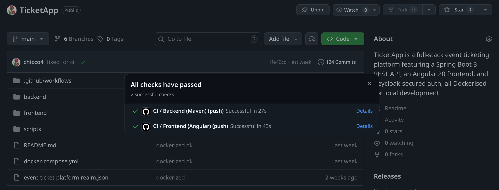

#### 5.4.3 Docker

Docker è stato impiegato per rendere riproducibile l’intero stack applicativo, includendo servizi di supporto come PostgreSQL, Adminer e Keycloak. Il file `docker-compose.yml` orchestra l’avvio dei container, collega i servizi sulla stessa rete bridge e propaga le variabili d’ambiente necessarie al back-end per raggiungere il database e il provider OAuth2. Il back-end viene costruito tramite una Dockerfile multi-stage che produce un JAR “fat” in fase builder e lo esegue su un’immagine JRE leggera; il front-end invece viene compilato con Node.js e poi servito tramite Nginx, replicando lo scenario di deploy.

```yaml
services:
  backend:
    build:
      context: ./backend
      dockerfile: Dockerfile
    environment:
      SPRING_DATASOURCE_URL: jdbc:postgresql://db:5432/db
      SPRING_SECURITY_OAUTH2_RESOURCESERVER_JWT_JWK_SET_URI: http://keycloak:8080/realms/event-ticket-platform/protocol/openid-connect/certs
    depends_on:
      - db
      - keycloak

  frontend:
    build:
      context: ./frontend
      dockerfile: Dockerfile
    depends_on:
      - backend
      - keycloak
```

## 6.0 Progettazione della piattaforma “Gestione Biglietti Eventi”

### 6.1 Analisi dei requisiti funzionali e non funzionali

La prima fase progettuale ha previsto workshop di raccolta requisiti con il tutor tecnico. I requisiti funzionali comprendevano la gestione di eventi, tipologie di biglietti, ordini, utenti e reportistica di base. Tra i requisiti non funzionali spiccavano scalabilità, sicurezza degli accessi, tracciabilità delle operazioni, tempi di risposta inferiori ai 500 ms e rispetto delle linee guida di accessibilità WCAG per l’interfaccia utente.

### 6.2 Modellazione concettuale e logica

#### 6.2.1 Diagrammi UML e casi d’uso

LucidChart è stato utilizzato per produrre diagrammi dei casi d’uso, sequenza e componenti. I casi d’uso principali riguardavano la creazione di un evento, la pubblicazione dell’inventario dei biglietti, l’acquisto da parte di un utente registrato e la validazione al check-in. I diagrammi di sequenza hanno aiutato a definire le interazioni tra front-end, API Gateway e microservizi di dominio.

#### 6.2.2 Definizione delle entità principali

La modellazione concettuale ha individuato le entità Evento, Location, Biglietto, TipologiaBiglietto, Ordine, Utente e Ruolo. Le relazioni sono state espresse tramite cardinalità precise: un evento può includere più tipologie di biglietto, un ordine contiene uno o più biglietti e ogni utente può generare vari ordini. Questa struttura ha costituito la base del modello logico implementato con JPA.

### 6.3 Architettura del sistema

#### 6.3.1 Visione d’insieme

L’architettura si basa su tre livelli: front-end Angular, back-end Spring Boot e database PostgreSQL. Il front-end comunica con un API Gateway che smista le richieste verso microservizi dedicati (gestione eventi, gestione biglietti, autenticazione). Un service di messaggistica (RabbitMQ) è stato ipotizzato per future evoluzioni orientate all’asincronia, pur non essendo implementato nella prima versione.

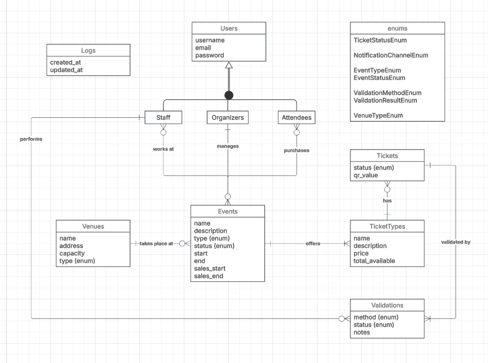

*Figura 6.1 – Diagramma architetturale con i microservizi e le integrazioni principali.*

#### 6.3.2 Comunicazione tra i moduli

La comunicazione avviene mediante REST API con payload JSON. Sono state definite convenzioni di naming per gli endpoint (`/api/events`, `/api/tickets`, `/api/orders`) e regole di versionamento (`/api/v1`). La gestione degli errori segue un formato uniforme con codici standardizzati e messaggi contestuali per facilitare il debugging lato front-end.

### 6.4 Progettazione dell’interfaccia utente

#### 6.4.1 Wireframe e mockup con Figma

Figma è servito a realizzare wireframe low-fidelity e successivamente mockup high-fidelity delle principali schermate: dashboard di amministrazione, form di creazione evento, catalogo pubblico e pannello di validazione biglietti. I mockup hanno consentito di definire componenti riutilizzabili (card evento, tabella ordini, modale di conferma) poi tradotti in componenti Angular.

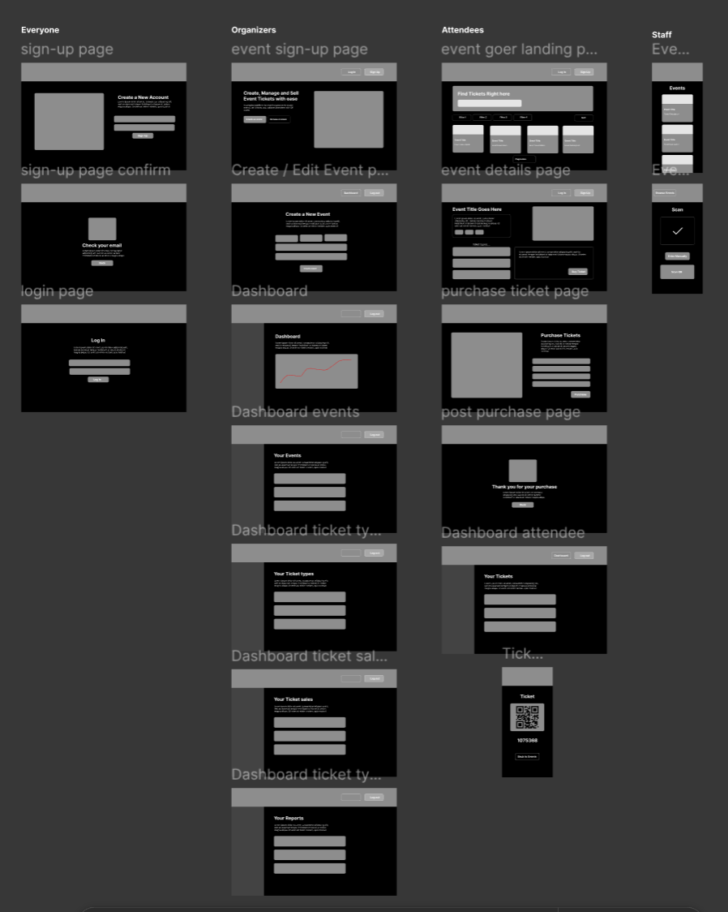

*Figura 6.2 – Anteprima dei mockup Figma utilizzati come riferimento visivo.*

#### 6.4.2 Scelte di design e UX

Le scelte grafiche si sono orientate su una palette neutra e sull’uso di layout responsive basati su Flex Layout. L’esperienza utente è stata semplificata con la suddivisione delle informazioni in sezioni chiare, feedback immediati sulle azioni (toast, indicatori di caricamento) e validazioni inline.

### 6.5 Flussi applicativi e ruoli utente

Il funzionamento della piattaforma si fonda su tre ruoli gestiti tramite Keycloak: `organizer`, `attendee` e `staff`. Gli organizer accedono a un’area riservata per gestire l’intero ciclo di vita degli eventi (creazione, modifica, pubblicazione, annullamento) e configurano le tipologie di biglietto con prezzi, capienza e periodi di vendita. Gli attendee visualizzano il catalogo pubblico degli eventi pubblicati, cercano per testo o categoria e acquistano biglietti singoli o multipli (fino a dieci unità per transazione), ricevendo in risposta i ticket digitali dotati di QR code. Lo staff effettua la validazione in loco: può cercare i biglietti per codice oppure scansionare il QR code, così da registrare l’ingresso e prevenire riutilizzi fraudolenti. Tutte le richieste sono protette da access token JWT rilasciati dal realm `event-ticket-platform` e le autorizzazioni lato back-end verificano i claim di Keycloak prima di concedere l’accesso alle API.

## 7.0 Implementazione

### 7.1 Sviluppo del back-end

#### 7.1.1 Struttura del progetto Spring Boot

Il back-end risiede nella directory `backend` ed è organizzato come un’unica applicazione Spring Boot che separa in modo netto configurazione, logica di dominio e infrastruttura. I file di build (`pom.xml`, `Dockerfile`, `API_DOCUMENTATION.md`) e gli script Maven (`mvnw`, `mvnw.cmd`) convivono accanto alla cartella `src`, suddivisa nei consueti rami `main` e `test`.

Dentro `src/main/java/com/chicco/backend` la gerarchia di package è uniforme:

- `config/` raggruppa la configurazione dell’applicazione (sicurezza, CORS, documentazione delle API).
- `controllers/` espone gli endpoint REST e delega l’elaborazione ai servizi.
- `services/` definisce le interfacce dei casi d’uso, con le relative implementazioni in `services/impl/`.
- `domain/` contiene gli oggetti del dominio (`entities`, `dtos`, `enums`) condivisi tra persistence e presentazione.
- `repositories/` incapsula l’accesso al database tramite Spring Data JPA.
- `filters/`, `mappers/`, `exceptions/` e `util/` ospitano rispettivamente i filtri HTTP, i mapper MapStruct, le eccezioni applicative e le classi di supporto condivise.

Le risorse applicative sono gestite in `src/main/resources`, dove risiedono la configurazione (`application.properties`) e le migrazioni Flyway (`db/migration`). La cartella `src/test/java` replica la struttura dei package principali per ospitare test unitari e di integrazione. In questo modo il progetto rimane monolitico ma modulare: ogni cartella definisce il proprio livello della stack e rende immediata la navigazione del codice durante sviluppo e debugging.

#### 7.1.2 CRUD per eventi e biglietti

Le operazioni CRUD coprono la gestione delle anagrafiche evento, la configurazione delle tipologie di biglietto e la generazione dell’inventario. Le richieste più comuni includono la creazione di un evento con disponibilità dei biglietti, l’aggiornamento di prezzi e quantità, la cancellazione logica (soft delete) e la ricerca filtrata per data, categoria o stato.

#### 7.1.3 Testing delle API con Insomnia

Insomnia è stato configurato con una workspace dedicata. Per ciascun endpoint sono stati definiti request template con variabili di ambiente (es. `{{base_url}}`). I test hanno coperto percorsi positivi e negativi, con particolare attenzione alla validazione dei payload e alla gestione delle eccezioni.

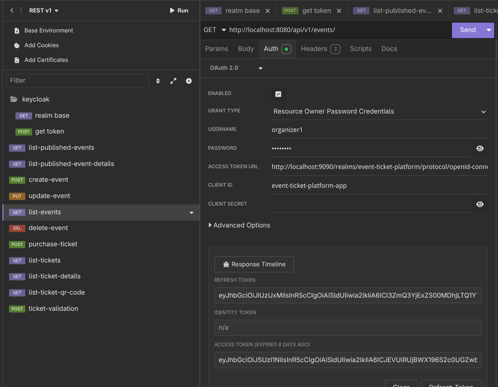

*Figura 7.1 – Workspace Insomnia utilizzata per il testing delle API.*

#### 7.1.4 Endpoints e logiche applicative

Tutte le API applicative sono versionate con prefisso `/api/v1`, accettano e producono payload JSON (`Content-Type: application/json`) e propagano eventuali errori in forma uniforme tramite `ErrorDto`. Le risposte paginabili sfruttano la semantica standard di Spring (`page`, `size`, `sort`), mentre l’unica eccezione binaria è la generazione del QR code (`image/png`). La tabella seguente riassume domini funzionali, contratti HTTP e codici di stato utilizzati.

| Dominio | Metodo e percorso | Accesso | Parametri / Body | Risposta | Codici |
|---------|-------------------|---------|------------------|----------|--------|
| Gestione eventi | `POST /api/v1/events`<br>`GET /api/v1/events`<br>`GET /api/v1/events/{event-id}`<br>`PUT /api/v1/events/{event-id}`<br>`DELETE /api/v1/events/{event-id}` | JWT con ruolo `ROLE_ORGANIZER` | Body `CreateEventRequestDto` o `UpdateEventRequestDto` con ticket incorporati; query `page`, `size`, `sort` | `CreateEventResponseDto`, `UpdateEventResponseDto`, `Page<ListEventResponseDto>`, `GetEventDetailsResponseDto` | `201` creazione, `200` lettura/aggiornamento, `204` cancellazione, `400` errori di validazione, `404` risorsa assente |
| Catalogo pubblico eventi | `GET /api/v1/published-events`<br>`GET /api/v1/published-events/{event-id}` | Accesso anonimo | Query opzionali `query`, `type`, `page`, `size` | `Page<ListPublishedEventResponseDto>`, `GetPublishedEventDetailsResponseDto` | `200` successo, `404` evento non pubblicato |
| Acquisto biglietti | `POST /api/v1/ticket-types/{ticket-type-id}` | JWT autenticato (`ROLE_ATTENDEE`) | Query `quantity` (default 1, min 1, max 10) | Lista `GetTicketResponseDto` | `201` acquisto riuscito, `409` sold-out, `400` vincoli non rispettati, `404` tipo biglietto inesistente |
| Portafoglio biglietti | `GET /api/v1/tickets`<br>`GET /api/v1/tickets/{ticket-id}`<br>`GET /api/v1/tickets/{ticket-id}/qr-code` | JWT del proprietario (`ROLE_ATTENDEE`) | Query `page`, `size`, `sort`; path `ticket-id` | `Page<ListTicketResponseDto>`, `GetTicketResponseDto`, PNG contenente il QR | `200` successo, `404` ticket non disponibile o non posseduto, `401` token non valido |
| Validazione accessi | `POST /api/v1/ticket-validations` | JWT con ruolo `ROLE_STAFF` | Body `TicketValidationRequestDto` (`id`, `method`) | `TicketValidationResponseDto` con stato finale | `200` validazione registrata, `404` ticket mancante, `400` dati incoerenti |
| Documentazione API | `GET /api/v1/docs` (`?group=public|internal`)<br>`GET /api/v1/docs/ui` | Accesso anonimo | Query `group` per selezionare il cluster di specification | Specifica OpenAPI in JSON/YAML o interfaccia Swagger UI | `200` consegna |

**Gestione eventi.** L’endpoint di creazione riceve il DTO `CreateEventRequestDto`, arricchito da ticket type annidati. Ogni ticket richiede nome, descrizione, prezzo e soglia quantitativa; in fase di salvataggio il servizio `EventServiceImpl` popola le entità `TicketType` legandole all’evento. Gli aggiornamenti verificano la coerenza tra UUID nel path e nel payload (`EventUpdateException` in caso di mismatch) e supportano tre scenari: creazione di nuovi ticket type (id nullo), modifica di quelli esistenti e rimozione di ticket non più presenti nella richiesta. La cancellazione è `DELETE` idempotente e opera soltanto sugli eventi appartenenti all’organizzatore autenticato.

Per rendere trasparente l’implementazione della **create event pipeline** è utile seguire il flusso end-to-end.

1. **Controller e mapping iniziale.** L’endpoint `POST /api/v1/events` del `EventController` riceve il JWT, esegue il parsing dell’UUID organizzatore e affida a MapStruct la conversione del payload in oggetto di dominio:

   ```java
   @PostMapping
   public ResponseEntity<CreateEventResponseDto> createEvent(
       @AuthenticationPrincipal Jwt jwt,
       @Valid @RequestBody CreateEventRequestDto createEventRequestDto) {

     CreateEventRequest createEventRequest = eventMapper.fromCreateEventRequestDto(createEventRequestDto);
     UUID userId = parseUserId(jwt);

     Event createdEvent = eventService.createEvent(userId, createEventRequest);
     CreateEventResponseDto createEventResponseDto = eventMapper.toCreateEventResponseDto(createdEvent);

     return new ResponseEntity<>(createEventResponseDto, HttpStatus.CREATED);
   }
   ```

   Le annotazioni `@AuthenticationPrincipal` e `@Valid` delegano a Spring Security l’estrazione del token e a Bean Validation la verifica dei vincoli dichiarativi (`@NotBlank`, `@NotEmpty`, `@NotNull`) definiti in `CreateEventRequestDto`. L’uso di `EventMapper` consente di separare DTO e modello di dominio (`CreateEventRequest`), evitando logica manuale nei controller.

2. **Logica di business e transazione.** Il metodo `EventServiceImpl#createEvent`, annotato con `@Transactional`, carica l’organizzatore tramite `UserRepository` e costruisce l’entità evento da persistere. Per ciascun ticket type richiesto viene creata un’istanza `TicketType`, agganciata al nuovo `Event` come soggetto proprietario della relazione uno-a-molti:

   ```java
   @Override
   @Transactional
   public Event createEvent(UUID organizerId, CreateEventRequest eventRequest) {
     User organizer = userRepository.findById(organizerId)
         .orElseThrow(() -> new UserNotFoundException(...));

     Event eventToCreate = new Event();

     List<TicketType> ticketTypesToCreate = eventRequest.getTicketTypes().stream().map(ticketType -> {
       TicketType ticketTypeToCreate = new TicketType();
       ticketTypeToCreate.setName(ticketType.getName());
       ticketTypeToCreate.setDescription(ticketType.getDescription());
       ticketTypeToCreate.setPrice(ticketType.getPrice());
       ticketTypeToCreate.setTotalAvailable(ticketType.getTotalAvailable());
       ticketTypeToCreate.setEvent(eventToCreate);
       return ticketTypeToCreate;
     }).toList();

     eventToCreate.setName(eventRequest.getName());
     eventToCreate.setDescription(eventRequest.getDescription());
     eventToCreate.setStatus(eventRequest.getStatus());
     eventToCreate.setType(eventRequest.getType());
     eventToCreate.setStart(eventRequest.getStart());
     eventToCreate.setEnd(eventRequest.getEnd());
     eventToCreate.setSalesStart(eventRequest.getSalesStart());
     eventToCreate.setSalesEnd(eventRequest.getSalesEnd());
     eventToCreate.setVenue(eventRequest.getVenue());
     eventToCreate.setOrganizer(organizer);
     eventToCreate.setTicketTypes(ticketTypesToCreate);

     return eventRepository.save(eventToCreate);
   }
   ```

   Il contesto di persistenza intercetta il salvataggio dell’evento e, grazie alla relazione cascata (`@OneToMany(cascade = CascadeType.ALL, orphanRemoval = true)` definita in `Event`), persiste automaticamente anche i `TicketType`. La violazione dei vincoli (ad esempio organizzatore inesistente) genera eccezioni specifiche (`UserNotFoundException`) intercettate dal `GlobalExceptionHandler` e tradotte in risposte HTTP semantiche (`404`).

3. **Serializzazione della risposta.** Una volta che JPA restituisce l’entità popolata (con UUID generato e timestamp ereditati da `Log`), il mapper converte l’oggetto dominio in `CreateEventResponseDto`. Questo DTO riporta i valori confermati dal database (identificativo, stato, date, ticket type con relativi ID), fornendo al front-end i dati necessari per la conferma e per eventuali redirect verso la schermata di dettaglio.

Il percorso completo mantiene le responsabilità ben separate: validazione e orchestrazione nel controller, logica di business nel servizio, regole di persistenza nelle entità e nei repository. In questo modo diventa immediato estendere la funzionalità (es. aggiungendo capienza massima del venue) intervenendo nel punto corretto della pipeline senza introdurre regressioni sugli altri layer.

**Catalogo pubblico degli eventi.** Le chiamate su `/api/v1/published-events` sfruttano `Pageable` e filtri opzionali. La ricerca normalizza la query (`trim`) e permette di combinare testo libero con la tipologia (`EventTypeEnum`). Solo eventi in stato `PUBLISHED` sono esposti: `getPublishedEvent` restituisce `404` quando l’UUID si riferisce a bozze o eventi annullati, salvaguardando il catalogo pubblico. La pipeline `listPublishedEvents` è suddivisa nei passaggi seguenti:

1. **Controller e criteri di ricerca.** `PublishedEventController#listPublishedEvents` accetta parametri opzionali `query` e `type` (enum) e il `Pageable` popolato da Spring. Se almeno uno dei filtri è presente richiama la ricerca avanzata, altrimenti esegue la lista semplice:

   ```java
   @GetMapping
   public ResponseEntity<Page<ListPublishedEventResponseDto>> listPublishedEvents(
       @RequestParam(required = false) String query,
       @RequestParam(required = false) EventTypeEnum type,
       Pageable pageable) {

     Page<Event> events;
     if ((null != query && !query.trim().isEmpty()) || type != null) {
       events = eventService.searchPublishedEvents(query, type, pageable);
     } else {
       events = eventService.listPublishedEvents(pageable);
     }

     return ResponseEntity.ok(events.map(eventMapper::toListPublishedEventResponseDto));
   }
   ```

   Il controller rimane pubblico (nessun `@AuthenticationPrincipal`), così le SPA e i client esterni possono interrogare il catalogo senza token. La scelta del ramo viene fatta valutando i filtri, evitando query di ricerca quando l’utente non ha fornito criteri.

2. **Servizio e sanificazione degli input.** In `EventServiceImpl` la lista base usa `findByStatus` per restituire esclusivamente eventi `PUBLISHED`. La variante di ricerca ripulisce la stringa (trim e null-safety) e delega a una query custom:

   ```java
   @Override
   public Page<Event> searchPublishedEvents(String query, EventTypeEnum type, Pageable pageable) {
     String sanitizedQuery = (query == null || query.trim().isEmpty()) ? null : query.trim();
     return eventRepository.searchEvents(sanitizedQuery, type, pageable);
   }
   ```

   Questo passaggio previene ricerche inutili su stringhe vuote e mantiene l’ordinamento richiesto dal `Pageable`.

3. **Repository e filtro dinamico.** `EventRepository#searchEvents` utilizza JPQL per applicare condizionalmente la ricerca full-text su nome, descrizione e venue, limitando sempre alle sole pubblicazioni:

   ```java
   @Query("SELECT e FROM Event e WHERE" +
       " e.status = com.chicco.backend.domain.enums.EventStatusEnum.PUBLISHED" +
       " AND (" +
       " :query IS NULL OR :query = ''" +
       " OR LOWER(e.name) LIKE LOWER(CONCAT('%', :query, '%'))" +
       " OR LOWER(e.description) LIKE LOWER(CONCAT('%', :query, '%'))" +
       " OR LOWER(e.venue) LIKE LOWER(CONCAT('%', :query, '%'))" +
       ")" +
       " AND (:type IS NULL OR e.type = :type)")
   Page<Event> searchEvents(@Param(\"query\") String query,
       @Param(\"type\") EventTypeEnum type,
       Pageable pageable);
   ```

   Le condizioni opzionali permettono di combinare ricerca testuale e filtro per tipologia senza costruire query dinamiche manuali. La clausola `status = PUBLISHED` è sempre applicata, così il catalogo pubblico rimane coerente.

4. **Mapping e risposta.** Come per la lista privata, il mapper trasforma la `Page<Event>` in `Page<ListPublishedEventResponseDto>`, serializzando solo i campi necessari alla card dell’homepage (titolo, tipologia, orari, venue). I metadati della paginazione permettono al front-end di mostrare pagine successive o indicare che non ci sono risultati; in assenza di corrispondenze la risposta contiene un `content` vuoto e il flag `empty=true`, ma mantiene HTTP 200 così da distinguere l’assenza di dati dal caso di errore.

**Acquisto dei biglietti.** Il metodo `purchaseTicket` del `TicketTypeController` impone il range 1-10 sulla quantità tramite annotazioni `@Min`/`@Max`. Prima di creare i ticket, il servizio effettua un lock pessimista (`findByIdWithLock`) per garantire consistenza in presenza di più acquisti concorrenti. Se il totale disponibile verrebbe superato, viene sollevata `TicketSoldOutException` che il `GlobalExceptionHandler` traduce in `409 Conflict`. La risposta aggrega i DTO dei ticket generati e, in caso di singolo acquisto, fornisce l’header `Location` verso `/api/v1/tickets/{id}`.

**Portafoglio biglietti e QR code.** Gli endpoint sotto `/api/v1/tickets` sono protetti e filtrano i record sul `purchaserId` ricavato dal JWT. La versione lista restituisce metadati minimi (stato, tipo di biglietto), mentre il dettaglio arricchisce le informazioni dell’evento (titolo, venue, orario). Il QR code viene generato on-demand con ZXing: alla prima richiesta il codice viene serializzato in Base64 e persistito, alle successive viene decodificato e restituito come PNG con header `Content-Length` e `Content-Type` adeguati. Errori di generazione sono mappati su `500` tramite `QrCodeGenerationException`.

**Validazione in ingresso.** Lo staff utilizza `/api/v1/ticket-validations` passando l’UUID del ticket e il metodo (`MANUAL` o `QR_CODE`). Il servizio carica l’operatore dal database, registra una `TicketValidation` e calcola lo stato (`VALID` alla prima lettura, `INVALID` se lo stesso ticket era già stato validato). Questo meccanismo supporta audit trail e impedisce riutilizzi fraudolenti dello stesso titolo d’accesso.

**Documentazione e osservabilità.** SpringDoc espone due gruppi: `public` per le rotte aperte e `internal` per l’intero set autenticato, entrambi scaricabili senza login. La UI raggiungibile su `/api/v1/docs/ui` consente di allegare manualmente un bearer token per provare le operazioni protette, mentre l’app Angular integra gli stessi contratti tipizzando i servizi HTTP. Il `GlobalExceptionHandler` centralizza gli errori più comuni (not found, sold out, validazione) in stringhe leggibili dal front-end, assicurando messaggi coerenti fra tutte le API.

#### 7.1.5 Integrazione con Keycloak e policy di accesso

La classe `SecurityConfig` definisce la catena di filtri Spring Security, esponendo una risorsa server OAuth2 che valida i bearer token emessi da Keycloak. Il frammento seguente mostra le regole di autorizzazione perimetrale dei tre ruoli applicativi:

```java
@Bean
SecurityFilterChain filterChain(HttpSecurity http,
    UserProvisioningFilter userProvisioningFilter,
    JwtAuthenticationConverter jwtAuthenticationConverter) throws Exception {
  http
      .cors(Customizer.withDefaults())
      .authorizeHttpRequests(auth -> auth
          .requestMatchers("/api/v1/docs/**", "/scalar/**", "/swagger-ui/**").permitAll()
          .requestMatchers("/api/v1/published-events/**").permitAll()
          .requestMatchers(HttpMethod.OPTIONS, "/**").permitAll()
          .requestMatchers("/api/v1/events/**").hasRole("ORGANIZER")
          .requestMatchers("/api/v1/ticket-validations/**").hasRole("STAFF")
          .anyRequest().authenticated())
      .csrf(AbstractHttpConfigurer::disable)
      .sessionManagement(session -> session
          .sessionCreationPolicy(SessionCreationPolicy.STATELESS))
      .oauth2ResourceServer(oauth2 -> oauth2
          .jwt(jwt -> jwt.jwtAuthenticationConverter(jwtAuthenticationConverter)))
      .addFilterAfter(userProvisioningFilter, BearerTokenAuthenticationFilter.class);
  return http.build();
}
```

L’abilitazione del CORS, l’impostazione `STATELESS` e l’aggiunta del filtro `UserProvisioningFilter` permettono di accogliere le richieste della SPA Angular, mantenendo il servizio privo di stato e popolando automaticamente la tabella `users` con i dati minimi provenienti dal token JWT.

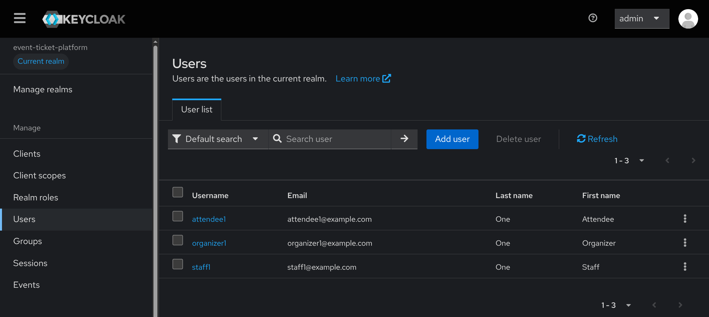

*Figura 7.2 – Configurazione del realm Keycloak utilizzato per l’autenticazione.*

#### 7.1.6 Gestione concorrente dell’acquisto dei biglietti

Per prevenire l’overbooking, il servizio `TicketTypeServiceImpl` applica un lock pessimista sul tipo di biglietto prima di conteggiare i ticket già venduti. La transazione atomica tutela la disponibilità residua:

```java
@Override
@Transactional
public List<Ticket> purchaseTickets(UUID userId, UUID ticketTypeId, int quantity) {
  TicketType ticketType = ticketTypeRepository.findByIdWithLock(ticketTypeId)
      .orElseThrow(() -> new TicketTypeNotFoundException(
          String.format("Ticket type with id %s not found", ticketTypeId)));

  int purchasedTickets = ticketRepository.countByTicketTypeId(ticketTypeId);
  Integer totalAvailable = ticketType.getTotalAvailable();
  if (totalAvailable != null && purchasedTickets + quantity > totalAvailable) {
    throw new TicketSoldOutException();
  }

  List<Ticket> ticketsToSave = new ArrayList<>(quantity);
  for (int i = 0; i < quantity; i++) {
    Ticket ticket = new Ticket();
    ticket.setStatus(TicketStatusEnum.PURCHASED);
    ticket.setTicketType(ticketType);
    ticket.setPurchaser(user);
    ticketsToSave.add(ticket);
  }

  return ticketRepository.saveAll(ticketsToSave);
}
```

L’uso di `@Transactional` e della query bloccante `findByIdWithLock` garantisce che due acquisti simultanei non possano superare la capienza configurata; l’eccezione `TicketSoldOutException` viene trasformata in una risposta HTTP 409 per informare il front-end del conflitto.

#### 7.1.7 Generazione e caching dei QR code

Il servizio `TicketServiceImpl` produce on demand l’immagine QR collegata al ticket e ne memorizza la versione Base64 per evitare rigenerazioni costose:

```java
@Override
public byte[] getQrCodeImageForUserAndTicket(UUID userId, UUID ticketId) {
  Ticket ticket = ticketRepository.findByIdAndPurchaserId(ticketId, userId)
      .orElseThrow(() -> new TicketNotFoundException("Ticket not found or not owned by user"));

  if (ticket.getQrValue() == null || ticket.getQrValue().isBlank()) {
    String base64 = generateQrCodeBase64(ticket.getId());
    ticket.setQrValue(base64);
    ticketRepository.saveAndFlush(ticket);
  }

  return Base64.getDecoder().decode(ticket.getQrValue());
}
```

La prima richiesta genera il codice QR tramite la libreria ZXing e lo persiste, mentre le richieste successive leggono il valore già presente nel database. Questo approccio riduce il carico computazionale sulle API e assicura che ogni QR sia deterministico rispetto all’identificativo del ticket.

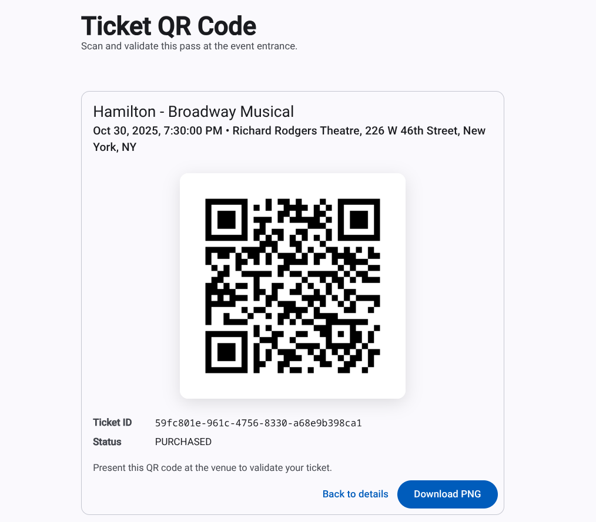

*Figura 7.3 – Anteprima del QR code associato ai ticket digitali.*

### 7.2 Sviluppo del front-end

#### 7.2.1 Struttura delle cartelle Angular

Il front-end vive nella cartella `frontend`, che contiene i file di configurazione del workspace (`angular.json`, `package.json`, `tsconfig*.json`), il `Dockerfile` usato per la containerizzazione e la directory `nginx/` con la configurazione di deployment. Il codice sorgente è raccolto in `src`, seguendo le convenzioni Angular con componenti standalone.

All’interno di `src/app` la suddivisione è per responsabilità:

- `core/` ospita guardie di routing, servizi HTTP tipizzati, modelli, costanti e utility condivise (es. logica di autenticazione Keycloak).
- `shared/` raccoglie i componenti e le pipe riutilizzabili; qui trovano posto header, footer, dialog di errore e la `quick-guide-card`.
- `pages/` raggruppa le funzionalità orientate al dominio, organizzate per ruolo (`attendee`, `organizer`, `staff`) con le relative pagine, template HTML e definizioni di routing secondarie.

Le risorse statiche sono servite da `public/` (icone, asset e manifest), mentre `src/environments/` contiene i file di configurazione per gli ambienti. Questa organizzazione rende evidente la distinzione tra infrastruttura del framework, logica di business e componenti condivisi, facilitando l’onboarding dei nuovi sviluppatori e la manutenzione evolutiva della SPA.

#### 7.2.2 Comunicazione con il back-end

I servizi HTTP sfruttano `HttpClient` e intercettori per allegare i token JWT rilasciati dal servizio di autenticazione. I metodi restituiscono `Observable` tipizzati e utilizzano operatori RxJS per trasformare le risposte e gestire gli errori.

#### 7.2.3 Validazione dei form e gestione stati

Le form reattive supportano validazioni sincrone (campo obbligatorio, formato email) e asincrone (verifica disponibilità nome evento). Uno store locale basato su `BehaviorSubject` mantiene lo stato della sessione e il carrello degli ordini, permettendo aggiornamenti reattivi del front-end.

#### 7.2.4 Route guard per la gestione dei ruoli

Il guard `canActivateAuthRole` incapsula la logica autorizzativa lato client. Il codice seguente verifica la presenza del ruolo richiesto e, in caso negativo, mostra un dialog coerente con le policy del back-end:

```ts
const isAccessAllowed = async (
  route: ActivatedRouteSnapshot,
  state: RouterStateSnapshot,
  authData: AuthGuardData
): Promise<boolean | UrlTree> => {
  const { authenticated, grantedRoles } = authData;
  const requiredRole = route.data['role'];
  if (!requiredRole) return false;

  const hasRequiredRole = (role: string): boolean => {
    const variants = [role, role.startsWith('ROLE_') ? role.substring(5) : `ROLE_${role}`];
    const normalizedVariants = variants.flatMap((r) => [r, r.toLowerCase()]);
    const realmRoles = grantedRoles.realmRoles?.map((r) => [r, r?.toLowerCase?.()]).flat() ?? [];
    if (normalizedVariants.some((rv) => realmRoles.includes(rv))) return true;
    const resourceRoles = Object.values(grantedRoles.resourceRoles || {}).flatMap((roles) =>
      (roles || []).flatMap((r) => [r, r?.toLowerCase?.()])
    );
    return normalizedVariants.some((rv) => resourceRoles.includes(rv));
  };

  if (authenticated && hasRequiredRole(requiredRole)) return true;

  const dialog = inject(MatDialog);
  dialog.open(ForbiddenDialog, {
    data: { requiredRole, attemptedRoute: state.url },
    width: '500px',
  });
  return false;
};
```

L’uso di varianti (`ROLE_X` e `x`) permette di coprire sia realm roles sia resource roles; il dialog riafferma all’utente quale ruolo è necessario senza interrompere la sessione.

#### 7.2.5 Ricerca eventi con form reattive e debounce

La pagina `AttendeeHome` sincronizza i controlli del form con l’API pubblica mediante debounce e normalizzazione degli input:

```ts
ngOnInit(): void {
  this.filtersSub = this.filtersForm.valueChanges
    .pipe(
      debounceTime(300),
      distinctUntilChanged((previous, current) =>
        (previous?.query ?? '') === (current?.query ?? '') &&
        (previous?.type ?? '') === (current?.type ?? '')
      )
    )
    .subscribe(() => this.fetchEvents(0));

  this.fetchEvents();
}

fetchEvents(page = 0, size = this.pageSize): void {
  this.loading = true;
  const filters = this.filtersForm.getRawValue();
  const trimmedQuery = filters.query.trim();

  this.publishedEvents
    .getPublishedEvents({
      page,
      size,
      sort: this.sort,
      query: trimmedQuery ? trimmedQuery : undefined,
      type: filters.type || undefined
    })
    .subscribe({
      next: (res) => {
        this.page = res;
        this.events = res.content;
        this.loading = false;
      },
      error: (err) => {
        this.loading = false;
        this.error = err?.error?.error || err?.error?.message || 'Failed to load events.';
      },
    });
}
```

La combinazione `debounceTime` + `distinctUntilChanged` evita richieste inutili mentre l’utente digita; gli errori vengono mostrati in un messaggio contestuale per migliorare la UX.

#### 7.2.6 Validazione dei ticket con QR scanner e fallback manuale

Il componente `StaffValidateTickets` integra l’API `BarcodeDetector` e gestisce la transizione automatica tra scansione e form manuale:

```ts
async startScanner(): Promise<void> {
  if (!this.scannerSupported) {
    this.scannerError = 'QR scanning is not supported on this device.';
    return;
  }

  if (!this.detector) {
    const barcodeDetector = (window as any).BarcodeDetector;
    this.detector = new barcodeDetector({ formats: ['qr_code'] });
  }

  const video = this.scannerVideo?.nativeElement;
  this.stream = await navigator.mediaDevices.getUserMedia({
    video: { facingMode: { ideal: 'environment' }, width: { ideal: 1280 }, height: { ideal: 720 } },
  });

  video.srcObject = this.stream;
  await video.play();
  this.scannerActive = true;
  this.scanNextFrame();
}

private async scanFrame(): Promise<void> {
  if (!this.scannerActive || !this.detector) return;
  const video = this.scannerVideo?.nativeElement;
  if (!video || video.readyState < HTMLMediaElement.HAVE_CURRENT_DATA) return;

  const barcodes = await this.detector.detect(video);
  const code = barcodes?.find((barcode) => typeof barcode.rawValue === 'string')?.rawValue?.trim();
  if (!code) return;

  this.stopScanner();
  this.validateTicket(code, TicketValidationMethod.QR_CODE);
}
```

Nel caso in cui la fotocamera non sia disponibile o la lettura fallisca, il form manuale con validazione `minLength` garantisce comunque la registrazione dell’ingresso, mantenendo allineati i log con il servizio Spring Boot.

#### 7.2.7 Esperienza utente per i diversi ruoli

L’area organizer presenta dashboard, quick guide e componenti Material per monitorare gli eventi, con paginazione e messaggi contestuali su successo o errore. Gli attendee navigano un catalogo dinamico con filtri, schede evento e percorsi di acquisto che precompilano i dati di pagamento e mostrano il totale aggiornato. Le schermate di conferma riportano il riepilogo dei ticket acquistati e i relativi QR code. Per lo staff è disponibile una pagina dedicata alla validazione veloce, dotata di form per codice manuale e supporto a dispositivi mobili per la scansione.

#### 7.2.8 Componenti riutilizzabili e Quick Guide

La libreria condivisa include componenti standalone riutilizzabili costruiti con le API `signal` e `input` introdotte in Angular 17. Il caso più emblematico è `QuickGuideCardComponent`, utilizzato sia nelle sezioni attendee sia staff per mostrare flussi guidati:

```ts
@Component({
  selector: 'app-quick-guide-card',
  standalone: true,
  imports: [CommonModule, MatCardModule, MatIconModule, MatListModule],
  templateUrl: './quick-guide-card.html',
  styleUrl: './quick-guide-card.css',
})
export class QuickGuideCardComponent {
  readonly title = input.required<string>();
  readonly subtitle = input.required<string>();
  readonly steps = input.required<QuickGuideStep[]>();
  readonly avatarIcon = input('explore');

  readonly dismissed = output<void>();
  private readonly hidden = signal(false);

  dismiss(): void {
    if (this.hidden()) return;
    this.hidden.set(true);
    this.dismissed.emit();
  }

  protected isHidden(): boolean {
    return this.hidden();
  }
}
```

Gli input tipizzati obbligano il chiamante a fornire titolo, sottotitolo e lista di passi, mentre `avatarIcon` dispone di un default. L’`output` `dismissed` comunica al genitore l’eventuale chiusura della card, consentendo di persistire la preferenza (es. nascondere la guida nelle sessioni successive). Lo stato locale è mantenuto via `signal`, evitando l’uso di `BehaviorSubject` o `@Input` mutabili.

Nel template sono impiegate le nuove structural directive `@if` e `@for`, riducendo boilerplate e mantenendo compatibilità con Angular Material:

```html
@if (!isHidden()) {
  <mat-card appearance="outlined" class="guide-card" (click)="dismiss()" role="button" tabindex="0">
    <mat-card-header>
      <div mat-card-avatar class="guide-avatar">
        <mat-icon>{{ avatarIcon() }}</mat-icon>
      </div>
      <mat-card-title>{{ title() }}</mat-card-title>
      <mat-card-subtitle>{{ subtitle() }}</mat-card-subtitle>
    </mat-card-header>
    <mat-card-content>
      <mat-list class="dense-list">
        @for (step of steps(); track step.text) {
          <mat-list-item>
            <mat-icon matListItemIcon>{{ step.icon }}</mat-icon>
            <div matListItemTitle>{{ step.text }}</div>
          </mat-list-item>
        }
      </mat-list>
    </mat-card-content>
  </mat-card>
}
```

Il componente espone un’interfaccia semplice (`QuickGuideStep`) che descrive icona e testo di ciascun passaggio; grazie alla natura standalone è possibile importarlo direttamente nei moduli delle pagine senza dichiarazioni aggiuntive. Questo approccio ha permesso di uniformare l’onboarding visuale tra i ruoli e di lasciare ai singoli container la responsabilità del testo e della visibilità della guida.

#### 7.2.9 Schermate principali dell’interfaccia

Le figure seguenti documentano le schermate chiave fruite dai tre ruoli applicativi lungo i rispettivi flussi.

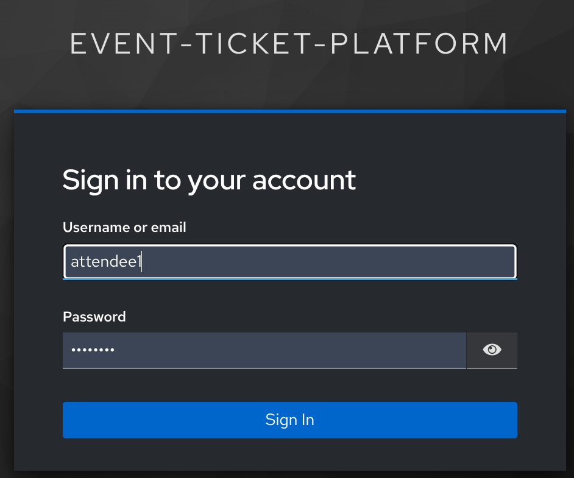

*Figura 7.4 – Accesso iniziale con reindirizzamento alla piattaforma Keycloak.*

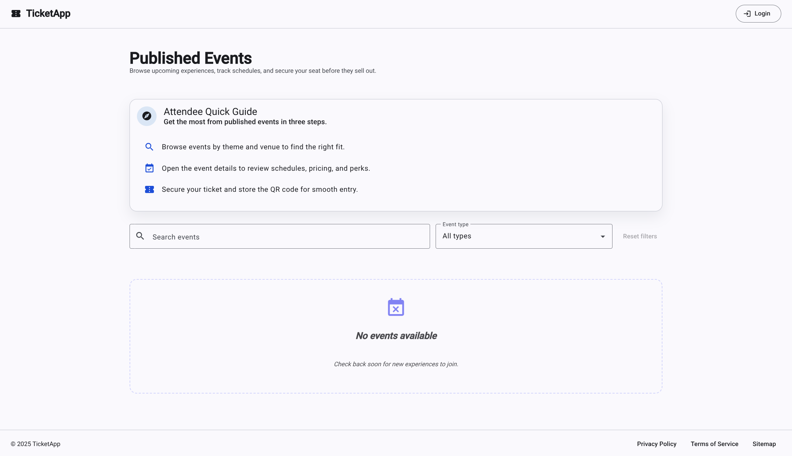

*Figura 7.5 – Vista iniziale del catalogo eventi mostrata agli utenti anonimi e agli attendee.*

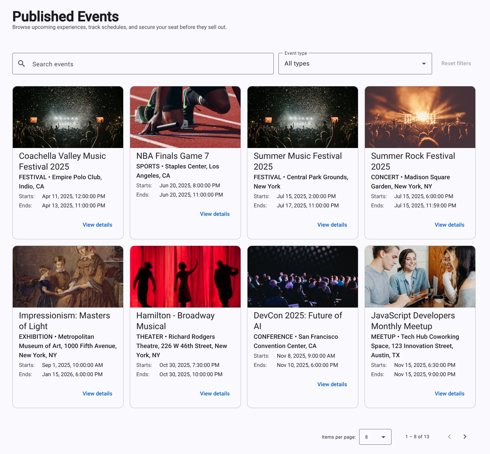

*Figura 7.6 – Schermata `PublishedEvents` con filtri dinamici di testo e tipologia.*

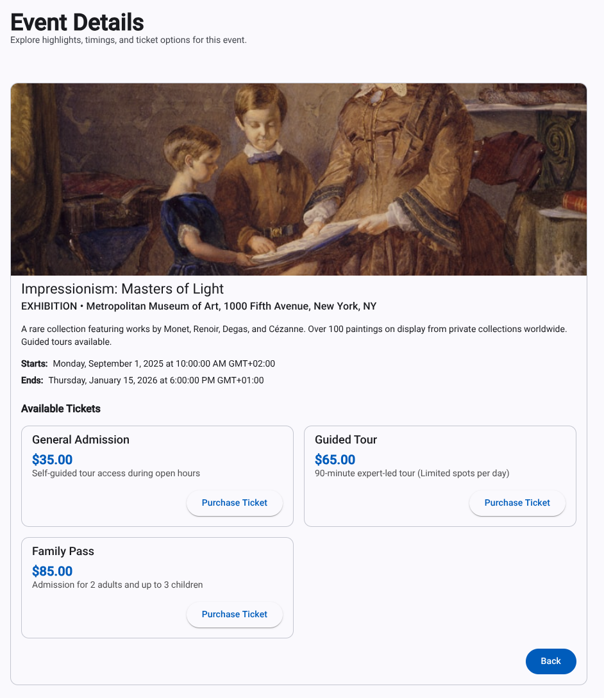

*Figura 7.7 – Pagina di dettaglio che riassume descrizione, location e disponibilità.*

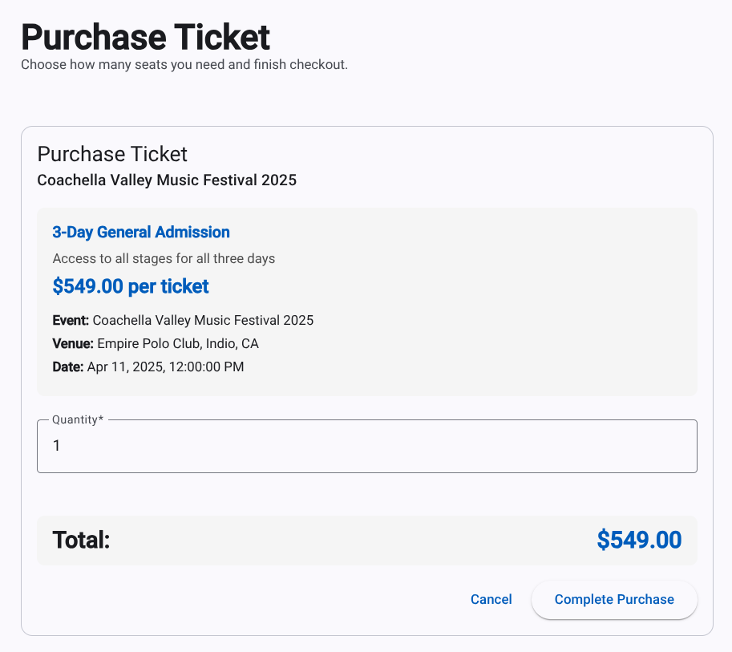

*Figura 7.8 – Form di checkout con selezione della quantità e riepilogo del costo totale.*

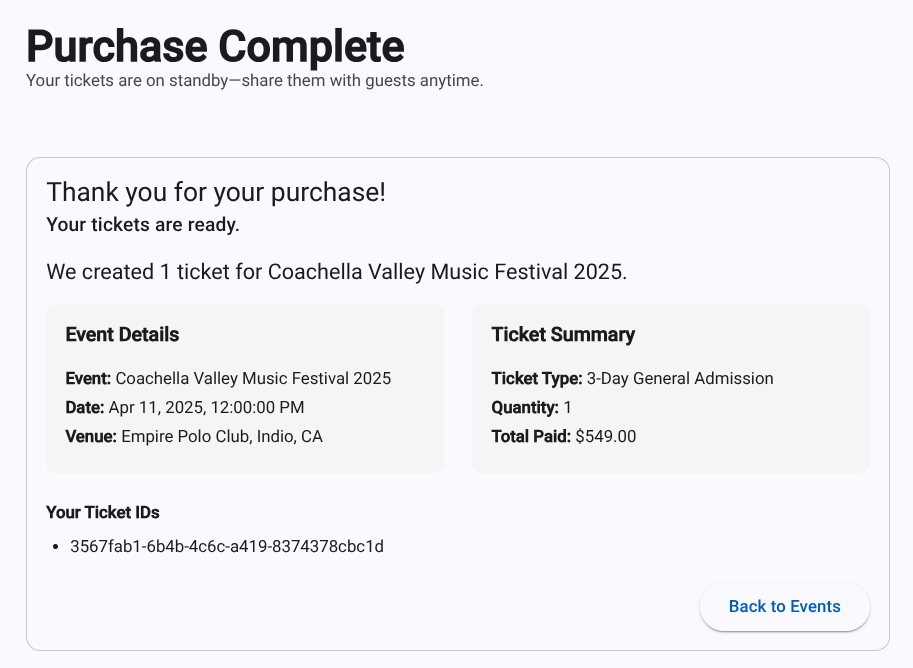

*Figura 7.9 – Messaggio di successo che recapitola l’ordine e i ticket generati.*

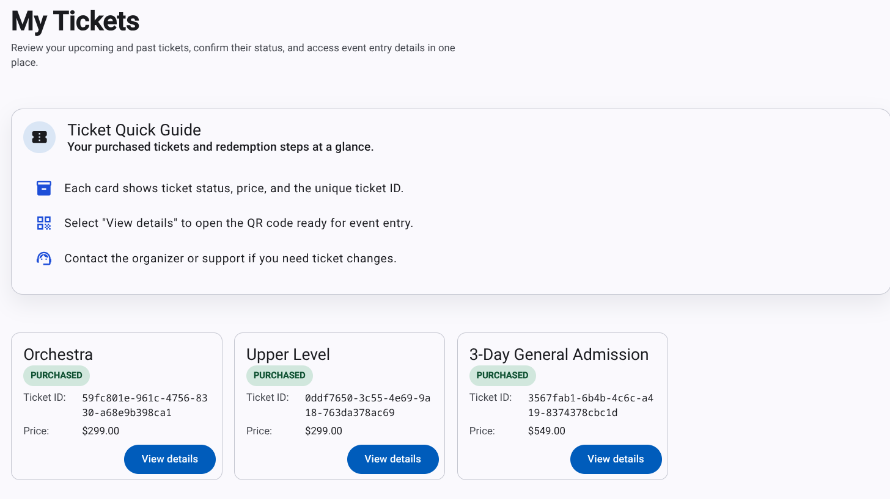

*Figura 7.10 – Dashboard personale con i ticket digitali associati all’account.*

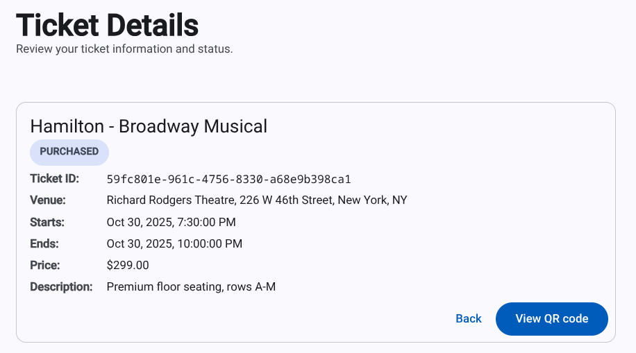

*Figura 7.11 – Vista di dettaglio del singolo ticket disponibile per il download.*

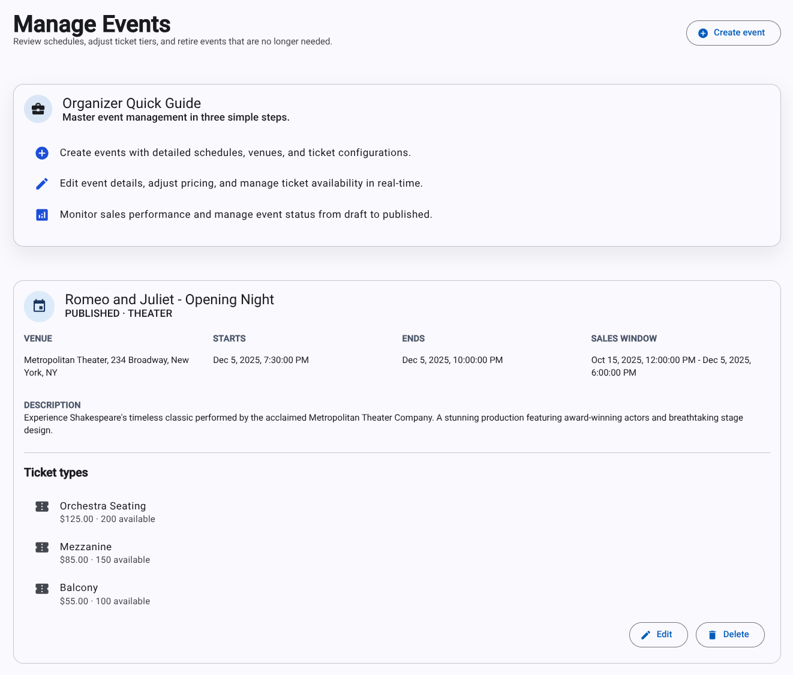

*Figura 7.12 – Lista amministrativa con strumenti di monitoraggio e quick guide.*

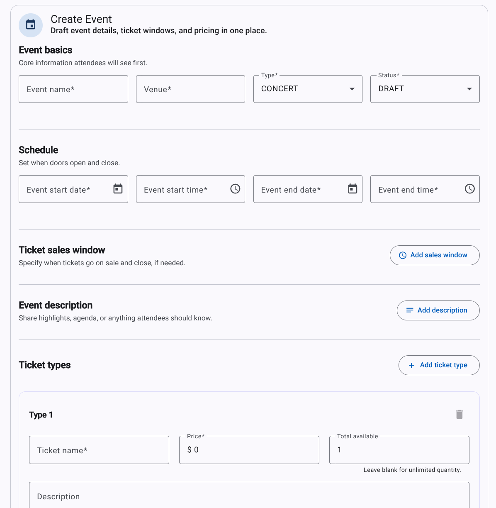

*Figura 7.13 – Form di inserimento evento con validazioni e anteprima dei ticket.*

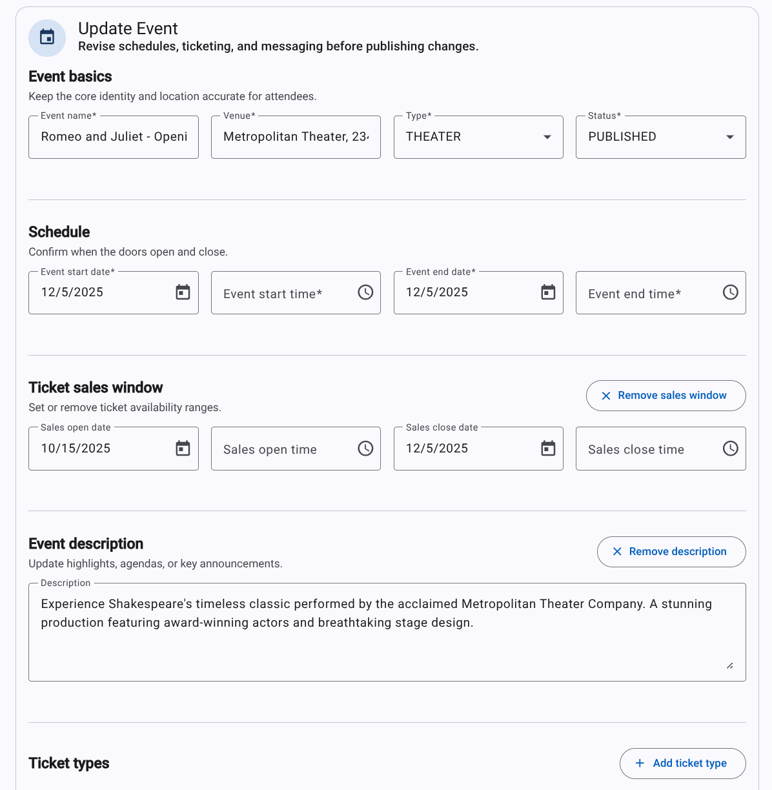

*Figura 7.14 – Editor per la modifica selettiva dei dati e delle tipologie di biglietto.*

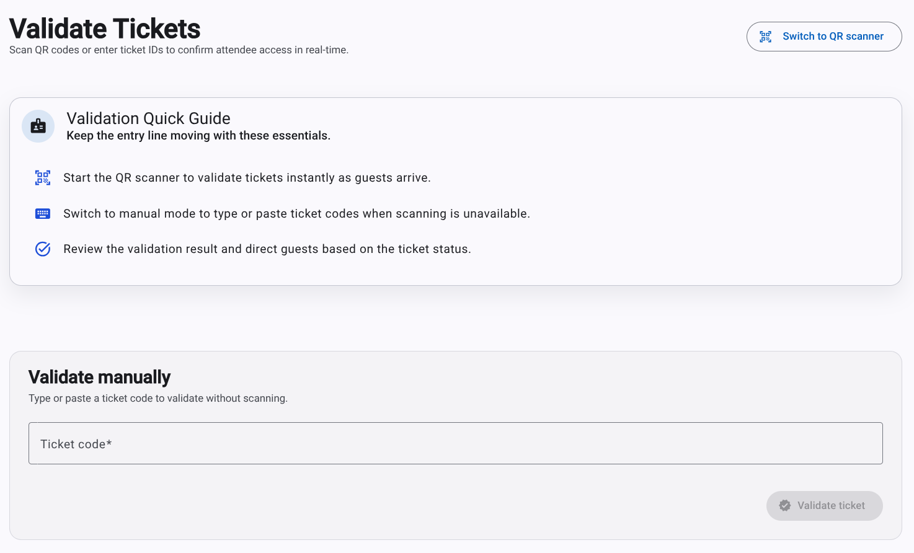

*Figura 7.15 – Dashboard dello staff con strumenti di scansione e ricerca manuale.*


*Figura 7.16 – Notifica di accesso consentito dopo la scansione del QR code.*

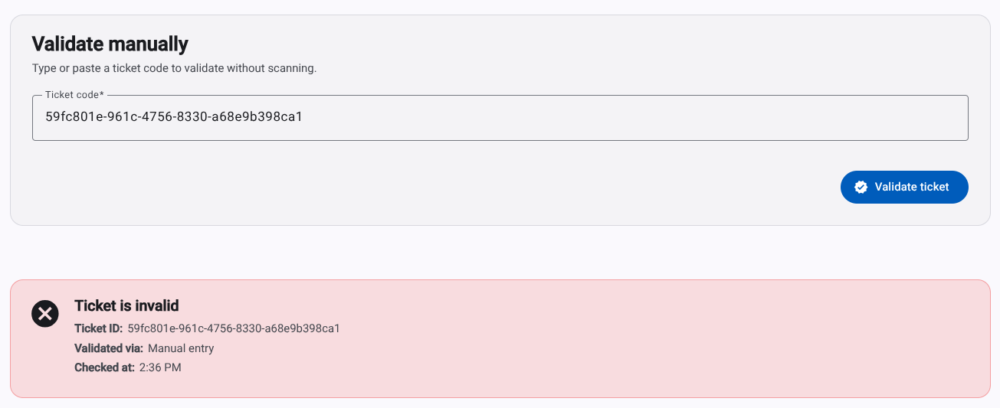

*Figura 7.17 – Feedback di errore per ticket già utilizzato o non riconosciuto.*

### 7.3 Integrazione e versionamento

#### 7.3.1 Utilizzo di Git e GitHub

Ogni nuova funzionalità veniva sviluppata su branch dedicati (`feature/event-crud`, `feature/angular-forms`). Le pull request includevano descrizione, checklist di QA e screenshot per il front-end. Le review del mentor assicuravano l’applicazione costante delle convenzioni introdotte.

#### 7.3.2 Workflow di sviluppo collaborativo

Nonostante lo stage individuale, è stato simulato un contesto collaborativo: merge request pianificate, gestione dei conflitti, uso delle GitHub Issues per tracciare bug e enhancement. Questa simulazione ha reso più fluido l’inserimento in eventuali team reali futuri.

### 7.4 Containerizzazione e deploy

#### 7.4.1 Configurazione di Docker

Per ciascun microservizio è stata definita una Dockerfile con build multi-stage: la prima fase costruisce l’applicazione tramite Maven, la seconda produce un’immagine runtime leggera basata su Temurin. Il front-end viene compilato con `ng build --prod` e servito da un’immagine Nginx configurata con routing verso l’API Gateway.
Un file `docker-compose.yml` orchestralizza i servizi applicativi insieme alle dipendenze infrastrutturali (PostgreSQL, Adminer, Keycloak). L’avvio locale con `docker compose up --build` produce un ambiente coerente con lo staging, facilita i test di integrazione e permette lo scambio di realm e dati seed già configurati.

#### 7.4.2 Automazione tramite GitHub Actions

Una pipeline di deploy orchestrata da GitHub Actions genera le immagini Docker, esegue i test automatis e, in caso di esito positivo, pubblica le immagini su GitHub Container Registry. Un job successivo aggiorna il file `docker-compose.yml` di staging, permettendo il provisioning automatico su ambiente interno SyncLab.

## 8.0 Risultati e test

### 8.1 Verifica funzionale

La verifica funzionale ha confermato il corretto funzionamento delle principali user story: creazione evento, emissione biglietti, pubblicazione nel catalogo pubblico, ricerca con filtri, acquisto multi-quantità e validazione finale. Le sessioni demo hanno evidenziato tempi di risposta coerenti con i requisiti e hanno permesso a stakeholder interni di navigare indifferentemente le aree organizer, attendee e staff, confermando uniformità di esperienza.

### 8.2 Test di integrazione e validazione

Sono stati sviluppati test di integrazione con Spring Boot Test per verificare l’interazione tra controller, servizio e repository. Angular ha beneficiato di test unitari su componenti e servizi, oltre a end-to-end test esplorativi tramite Cypress. Il coverage complessivo ha superato il 70%, soglia concordata per la prima release.

### 8.3 Performance e stabilità

Un ciclo di test prestazionali con JMeter ha simulato 200 utenti concorrenti su scenari di consultazione e acquisto. Le API hanno mantenuto tempi medi di risposta inferiori a 350 ms, con picchi gestiti grazie al connection pooling di Spring Data. L’uso di Docker ha reso riproducibili gli ambienti di test, riducendo le differenze rispetto all’ambiente di sviluppo.

### 8.4 Problemi riscontrati e soluzioni adottate

Le principali criticità hanno riguardato la gestione delle transazioni in caso di ordini paralleli; è stata introdotta una strategia di locking ottimistico con versioning dei biglietti per evitare overbooking. Un ulteriore problema ha interessato la serializzazione dei dati nei form Angular, risolto creando adapter per l’allineamento dei form model con i DTO back-end.

## 9.0 Considerazioni finali

### 9.1 Risultati raggiunti

Gli obiettivi iniziali sono stati raggiunti: la piattaforma è pienamente funzionante, i processi DevOps sono automatizzati e la documentazione tecnica accompagna ogni modulo. Il progetto è stato presentato al tutor SyncLab ottenendo feedback positivi sulla qualità del codice e sulla chiarezza della documentazione.

### 9.2 Competenze acquisite

Lo stage mi ha permesso di consolidare competenze tecniche (Spring, Angular, Docker, GitHub Actions) e soft skill (pianificazione, comunicazione efficace, gestione del tempo). L’applicazione concreta di pattern architetturali e pratiche di sviluppo professionali ha colmato il divario tra teoria accademica e industria.

### 9.3 Possibili sviluppi futuri

Tra le evoluzioni proposte figurano l’introduzione di un sistema di raccomandazione eventi, l’integrazione con gateway di pagamento, la realizzazione di una app mobile companion e l’adozione di metriche osservabilità (Prometheus, Grafana) per il monitoraggio avanzato.

### 9.4 Conclusioni personali

L’esperienza in SyncLab ha rappresentato un passaggio fondamentale nel mio percorso di formazione. Lavorare su un progetto end-to-end, affiancato da professionisti del settore, ha rafforzato la motivazione verso la carriera nello sviluppo software e ha confermato l’importanza di un apprendimento continuo. La piattaforma Eventi rimane la testimonianza tangibile della crescita professionale maturata in due mesi di lavoro intenso e strutturato.
